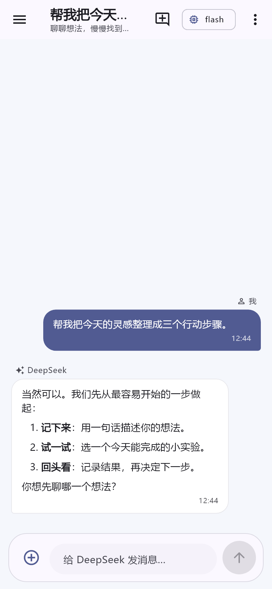
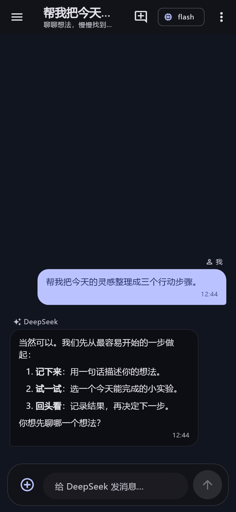
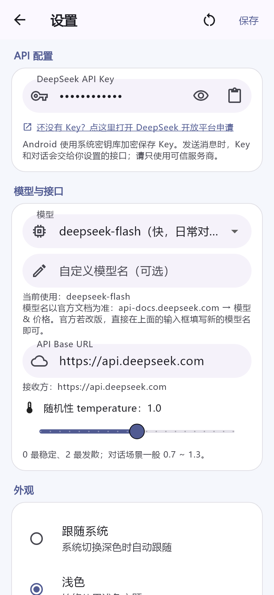

# DeepSeek 助手 · 1.1.7

第三方 Android 聊天客户端：流式回复、思考过程、多会话历史、图片与文本附件、浅色 / 深色模式。使用者自行填写 API Key，与 DeepSeek 官方无隶属关系。

## 下载与更新

从 [v1.1.7 Release](https://github.com/tingwu-h/deepseek-chat-app/releases/tag/v1.1.7) 下载 `deepseek-chat-v1.1.7.apk`。支持 Android 7.0+，含 arm64-v8a、armeabi-v7a、x86_64。

1.1.7（构建号 10）保留 1.1.6 的包名和签名，目的是支持覆盖安装。不要为了更新先卸载旧应用；卸载会删除本地数据。签名已核对，实际机型上的覆盖安装仍需实测。当前延续历史调试证书，不宣称已切换正式发布签名；后续签名迁移必须另行规划。

## 本次变化

- 主页首次返回提示“再按一次回到桌面”，两秒内第二次返回保存后回桌面。抽屉和键盘优先关闭，设置页正常返回。
- 生成中切换 / 新建会话、停止、转后台，按原会话保存已收到的回复；生成期间每两秒保存一次。
- 停止按钮取消网络请求及订阅，旧请求不能污染新会话。服务商最终计费用量以服务商为准。
- 修复流式状态，生成时使用轻量文字渲染，结束后显示 Markdown。
- 优化气泡、圆角输入栏、历史选中态与浅深色卡片；修复窄屏模型选择框溢出。
- Android Key 使用 Keystore + AES-GCM 加密保存；首次启动迁移旧 Key，迁移成功后再移除普通设置中的明文。
- 自定义接口必须使用 HTTPS，更换接收域名时明确确认 Key 与聊天内容的发送目的地。
- 删除会话时清理不再被其他会话引用的图片，移除待发送图片也清理副本，不删除相册原文件。
- 图片单张 5 MB、一次最多 6 个附件、合计 15 MB；文本文件最多 256 KB / 60,000 字符。超限或读取失败明确提示，不静默丢图或截断。
- 图片对话使用支持图片的模型；当前预置使用 deepseek-flash。切换到不兼容模型时会提醒。
- 不再因为超过 100 个会话 / 500 条消息而自动删历史；索引缺失时恢复已有会话。
- 设置页新增“导出聊天文字”，通过 Android 文件选择器保存 JSON；不包含 Key、图片文件或本机图片路径。
- 完善 GitHub App 查询声明、JSON 响应兼容和清空确认。

## 使用

### 界面预览

以下由实际 Flutter 组件以模拟聊天内容渲染，字体使用本机预览字体，并非手机实拍。

  

左侧菜单 → 设置 → 填写 API Key → 保存。Key 可在 [DeepSeek 开放平台](https://platform.deepseek.com)申请。“测试连接”会发出真实请求，可能产生 API 用量。

图片入口从相册选择，当前没有独立拍照按钮。文件支持 txt / md / json / csv / 代码等纯文本，不支持解析 PDF / Word。模型能力以[官方文档](https://api-docs.deepseek.com/zh-cn/quick_start/pricing)为准。

## 隐私与数据

聊天数据保存在设备应用私有目录。Android 密钥加密不等于聊天内容全部加密。发送时，所选接口会收到密钥、当前会话上下文和附件；自定义 Base URL 可能属于第三方，请只使用可信服务。系统备份与设备迁移已排除此 App 的数据，重要文字请主动导出。导出 JSON 含聊天内容，请妥善保存。

当前持续验证的平台是 Android。其他平台没有持久安全存储实现，密钥仅留内存，不应视为已经支持发布的 iOS / 桌面版本。

## 开发与离线构建

已验证 Flutter **3.47.5**、Dart **3.13.4**、JDK **17**、Android SDK **36**。已提交 `pubspec.lock`、Gradle wrapper 和图标，无需再运行 `flutter create .` 覆盖原生代码。

```powershell
# 使用已有 C:\dsbuild 工具及缓存，不重复下载
& .\tools\build-release-offline.ps1
```

脚本只构建与校验证书，不上传 GitHub、不安装 App。若缺少 SDK 或依赖缓存，会失败并报告，不自动下载。产物位于 `dist/deepseek-chat-v1.1.7.apk`。

```shell
flutter pub get --offline
flutter analyze --no-pub
flutter test --no-pub
```

测试使用模拟接口，不依赖真实 API Key。修复与验收记录见 [1.1.7 更新说明](docs/1.1.7-更新说明.md)。

## 许可证

[MIT](LICENSE)
